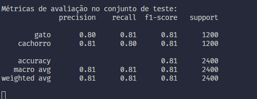
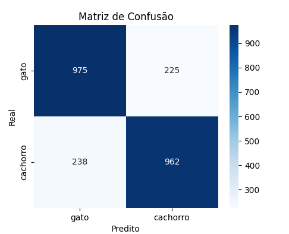
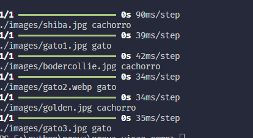

# prova-visao-comp

O código desse reposotório se destina a aplicar certos filtros de imagens, sendo estes (redimensionamento para 128 x 128), GaussianBlur e Histograma em imagens de animais, e também, o treinamento de um modelo de CNN (Convolutional Neural Network) para reconhecer cães e gatos.

## Como executar

  Primeiro execute `pip install -r "requirements.txt"` e depois `python main.py`

### Filtros

 Para os filtros, a biblioteca cv2 está sendo usada, principalmente as funções: imread, resize, GaussianBlur e EqualizeHist, essas funções são usadas no pipeline de filtros para, respectivamente: ler imagem, redimensionar, aplicar Blur Gaussiano e aplicar histograma. Após isso a biblioteca matplotlib está sendo usada para mostrar as imagens e filtros.

### Modelo de CNN

Para o treinamento do modelo está sendo usado as bibliotecas TensorFlow, Keras e Scikit-Learn. O dataset usado para o treinamento foi o Cifar10, foi filtrado para que somente as imagens de cachorros e gatos fossem usadas.

Primeiramente, foi carregado o modelo Cifar10, selecionado somente as imagens de cães e gatos para o treinamento e aplicado um split de 80% para treinamento e 20% para teste.

Já na construção do modelo, foi construido um modelo de CNN com Keras, tendo 9 camadas, algumas camadas repetem algumas funções para aprimorar o modelo (ex: aprofundar a extração de padrões), as funções são:

1. Conv2D: Extrai mapas de caracteristicas (features) usando filtros 3x3 das imagens
2. MaxPooling2D: Reduz a dimensionalidade dos mapas de características, pegando o valor máximo em janelas 2x2
3. Flatten: Achata os mapas 2D em um vetor 1D para alimentar a camada densa
4. Dense: Camada totalmente carregada com X neuronios (64 nessa implementação), permitindo combinações não lineares dos padrões extraídos
5. Dropout: Durante o treino, desativa aleatoriamente 30% dos neurônios para evitar overfitting

Esse modelo foi projetado para classificar as imagens entre gatos e cachorros. Foi usado 30 épocas.

#### Data Aumentation

Foi usada a técnica de Data Augmentation para gerar variações das imagens de treino com o intuito de aumentar a diversidade de dados e ajudar o modelo a classificar melhor, reduzindo o risco de overfitting e melhorando a robustez do modelo. As técnicas usadas foram pequenas rotações, deslocamentos e espelhamentos nas imagens, variando a cada época de treino.

### Resultados

As métricas de avaliação foram Precision, Recall e F1-Score, a acurácia do modelo sendo em média 80%

Também foi gerado uma matriz de confusão

O modelo conseguiu predizer corretamente na maioria dos casos.

### Tempo Gasto

O tempo de treinamento é de em aproximadamente 2 minutos, variando com o número de épocas usadas, cada época demora cerca de 4 segundos
O tempo de desenvolvimento foi cerca de 7 horas

### Dificuldades

A maior dificuldade foi em relação a precisão do modelo, foi necessário fazer vários ajustes, tanto na arquitetura do modelo, adicionando e ajustando as camadas, ajuste no numero de épocas, quanto na implementação de técnicas como o data augmentation para melhorar a acurácia
